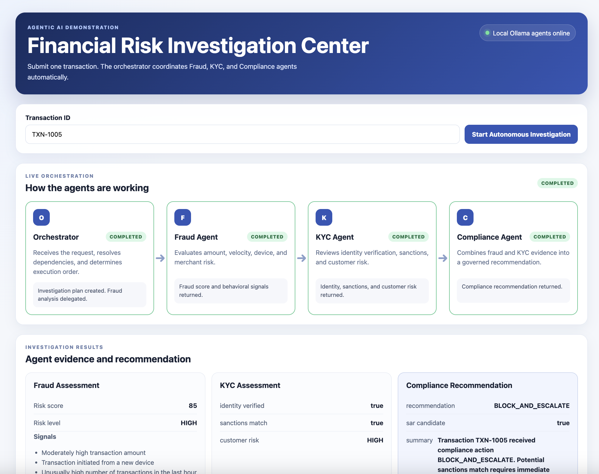

# Autonomous Financial Risk Investigation Platform

<h2 align="center">Dashboard</h2>

<p align="center">
  
</p>

An enterprise-style **multi-agent AI system** that autonomously investigates financial transactions using specialized AI agents for **Fraud Detection, KYC, and Compliance**.

This project demonstrates modern **Agentic AI architecture** where an Orchestrator coordinates multiple specialist agents while deterministic business logic performs trusted financial decisions.

---

# Demo

## User Workflow

```
User
   │
   ▼
Enter Transaction ID
   │
   ▼
Start Investigation
   │
   ▼
Orchestrator Agent
   │
   ├────────► Fraud Agent
   │
   ├────────► KYC Agent
   │
   └────────► Compliance Agent
   │
   ▼
Combined Investigation Report
   │
   ▼
Human Review
```

---

# Architecture

```
                    User
                      │
                      ▼
          Investigation Dashboard
                      │
                      ▼
            FastAPI Backend
                      │
                      ▼
           Orchestrator Agent
                      │
      ┌───────────────┼────────────────┐
      ▼               ▼                ▼
 Fraud Agent      KYC Agent      Compliance Agent
      │               │                │
      ▼               ▼                ▼
 Fraud Engine     KYC Engine     Compliance Engine
 (Python Rules)  (Python Rules) (Python Rules)
      │               │                │
      └───────────────┼────────────────┘
                      ▼
          Investigation Report
                      ▼
             Human Investigator
```

---

# Features

- Autonomous Orchestrator Agent
- Fraud Investigation Agent
- KYC & Identity Verification Agent
- Compliance Recommendation Agent
- FastAPI REST API
- Interactive Frontend Dashboard
- Live Agent Status
- Audit Trail
- Explainable AI
- Human-in-the-loop Governance
- Local LLM Support (Ollama + Llama 3.1)
- LangChain Tool Calling
- Modular Agent Architecture

---

# Fraud Agent

The Fraud Agent evaluates transaction behavior using explainable rules.

### Signals

- Transaction Amount
- New Device Detection
- Transaction Velocity
- Merchant Risk
- Country Risk (optional)

Outputs

- Fraud Risk Score
- Risk Level
- Fraud Signals

---

# KYC Agent

The KYC Agent evaluates customer identity.

Checks

- Identity Verification
- Sanctions Screening
- Customer Risk Rating

Outputs

- Identity Status
- Sanctions Match
- Customer Risk

---

# Compliance Agent

The Compliance Agent combines Fraud and KYC evidence.

Outputs

- Recommendation
- SAR Candidate
- Human Review Required

Examples

```
APPROVE_WITH_MONITORING

ESCALATE_FOR_MANUAL_REVIEW

BLOCK_AND_ESCALATE
```

---

# Orchestrator

The Orchestrator controls the workflow.

Responsibilities

- Receive investigation request
- Determine required specialists
- Coordinate execution
- Collect evidence
- Produce final report

---

# Technology Stack

Backend

- Python 3.11
- FastAPI
- Pydantic
- Uvicorn

AI

- LangChain
- Ollama
- Llama 3.1

Frontend

- HTML
- CSS
- JavaScript

Architecture

- Agentic AI
- Tool Calling
- Deterministic AI
- Human-in-the-loop

---

# Project Structure

```
fraud-agent/

├── app/
│
├── agents/
│   ├── orchestrator.py
│   ├── fraud_agent.py
│   ├── kyc_agent.py
│   ├── compliance_agent.py
│   ├── specialist_agents.py
│   └── investigation_orchestrator.py
│
├── data/
│   └── dummy_data.py
│
├── routes/
│   └── investigation_routes.py
│
├── static/
│   ├── index.html
│   ├── styles.css
│   └── app.js
│
├── models.py
├── main.py
│
├── requirements.txt
│
└── README.md
```

---

# ▶ Running the Project

Clone

```bash
git clone https://github.com/YOUR_USERNAME/fraud-agent-prototype.git
```

Install

```bash
python -m venv .venv

source .venv/bin/activate

pip install -r requirements.txt
```

Run

```bash
python -m uvicorn app.main:app --reload
```

Open

```
http://127.0.0.1:8000
```

Swagger

```
http://127.0.0.1:8000/docs
```

---

# Investigation Workflow

```
User
 │
 ▼
Enter Transaction ID
 │
 ▼
Frontend
 │
 ▼
FastAPI
 │
 ▼
Orchestrator
 │
 ├── Fraud Agent
 │
 ├── KYC Agent
 │
 └── Compliance Agent
 │
 ▼
Final Investigation Report
 │
 ▼
Human Approval
```

---

# Enterprise AI Concepts Demonstrated

✅ Multi-Agent Architecture

✅ AI Orchestration

✅ Tool Calling

✅ Explainable AI

✅ Human Approval

✅ Agent Collaboration

✅ Financial Risk Investigation

✅ KYC

✅ Compliance

✅ FastAPI

✅ LangChain

✅ Ollama

---

# Future Enhancements

- Agent Memory
- Case Management
- Human Approval Queue
- Microsoft Teams Integration
- Email Notifications
- Graph-based Agent Orchestration
- RAG Knowledge Base
- Real Banking APIs
- Kafka Event Streaming
- Azure OpenAI Support
- MCP Integration
- CrewAI/LangGraph Support

---

# 👤 Author

**Shelka Sachdeva**

Product Manager | AI | Agentic AI | Financial Services | Data & Analytics


---

⭐ If you found this project useful, please consider starring the repository.
